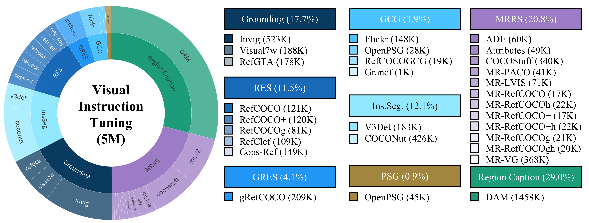

# Training VLM

## Dataset Preparation
We have collected the following datasets, which collectively cover two major categories of tasks: mask generation and mask understanding.
<p align="center"></p>

### Tokenizing 2D mask
Here we provide two examples to illustrate how to tokenize samples from the GRES dataset and samples from the DAM dataset.

- GRES: [datasets/tokenize_2d_mask/tokenize_gres.py](projects/samtok/datasets/tokenize_2d_mask/tokenize_gres.py)
- DAM: [datasets/tokenize_2d_mask/tokenize_dam.py](projects/samtok/datasets/tokenize_2d_mask/tokenize_dam.py)

### Convert to conversations
You need to convert all mask-related datasets into a unified VQA format. Here is an example, and you can download it from [here](https://huggingface.co/datasets/zhouyik/SAMTok_Training_Data/blob/main/mask_generation_gres209k.json) for subsequent training and debugging.
```json
{
    "image": "coco/train2014/COCO_train2014_000000098304.jpg",
    "conversations": [
        {
            "from": "human",
            "value": "<image>\nPlease identify and segment the front black chair in this image"
        },
        {
            "from": "gpt",
            "value": "```json\n[{\"mask_2d\": \"<|mt_start|><|mt_0230|><|mt_0345|><|mt_end|>\", \"label\": \"front black chair\"}]\n```"
        }
    ]
}
```

## Launch Training

### Adding new tokens
Before launch training, you need to add new tokens to the base model's vocabulary. You can refer to [this script](projects/samtok/utils/add_special_tokens.py).
```python
from transformers import Qwen3VLForConditionalGeneration, AutoProcessor
from tokenizers import AddedToken
import torch, os

model_id = "Qwen/Qwen3-VL-8B-Instruct"
save_dir = "Qwen/Qwen3-VL-8B-MT256x2"

MT_START_TOKEN = '<|mt_start|>'
MT_END_TOKEN = '<|mt_end|>'
MT_CONTEXT_TOKEN = '<|mt_{}|>'
new_tokens = [MT_START_TOKEN] + [MT_CONTEXT_TOKEN.format(str(code).zfill(4)) for code in range(256*2)] + [MT_END_TOKEN]

processor = AutoProcessor.from_pretrained(model_id, trust_remote_code=True)
tokenizer = processor.tokenizer
added = tokenizer.add_tokens(
    [AddedToken(t, lstrip=False, rstrip=False, single_word=False, normalized=False) for t in new_tokens],
    special_tokens=False,
)
print("added:", added)
os.makedirs(save_dir, exist_ok=True)
processor.save_pretrained(save_dir)
tokenizer.save_pretrained(save_dir)

model = Qwen3VLForConditionalGeneration.from_pretrained(model_id, torch_dtype=torch.bfloat16, trust_remote_code=True, device_map="auto")
model.resize_token_embeddings(len(tokenizer))

with torch.no_grad():
    emb = model.get_input_embeddings().weight
    old_vocab = emb.shape[0] - added
    mu = emb[:old_vocab].mean(0, keepdim=True)
    std = emb[:old_vocab].std(0, keepdim=True).clamp_min(1e-3)
    emb[old_vocab:].copy_(mu + 0.02 * torch.randn_like(emb[old_vocab:]) * std)

model.save_pretrained(save_dir)
print("Saved to", save_dir)
```

### Training with Xtuner
We provide three example configurations for different base models:
- PLM: [configs/perceptionlm_1b_mt256x2.py](projects/samtok/configs/perceptionlm_1b_mt256x2.py)
- Qwen2.5VL: [configs/qwen25vl_3b_mt256x2.py](projects/samtok/configs/qwen25vl_3b_mt256x2.py)
- Qwen3VL: [configs/qwen3vl_4b_mt256x2.py](projects/samtok/configs/qwen3vl_4b_mt256x2.py)

To launch training, run
```
bash tools/dist.sh train projects/samtok/configs/qwen3vl_4b_mt256x2.py 8 --deepspeed deepspeed_zero2
```

### Training with MS-SWIFT
Installing MS-SWIFT first, 
```
pip install ms-swift -U
```
To launch training, run
```
bash projects/samtok/swift/sft_qwen3vl_4b.sh
```